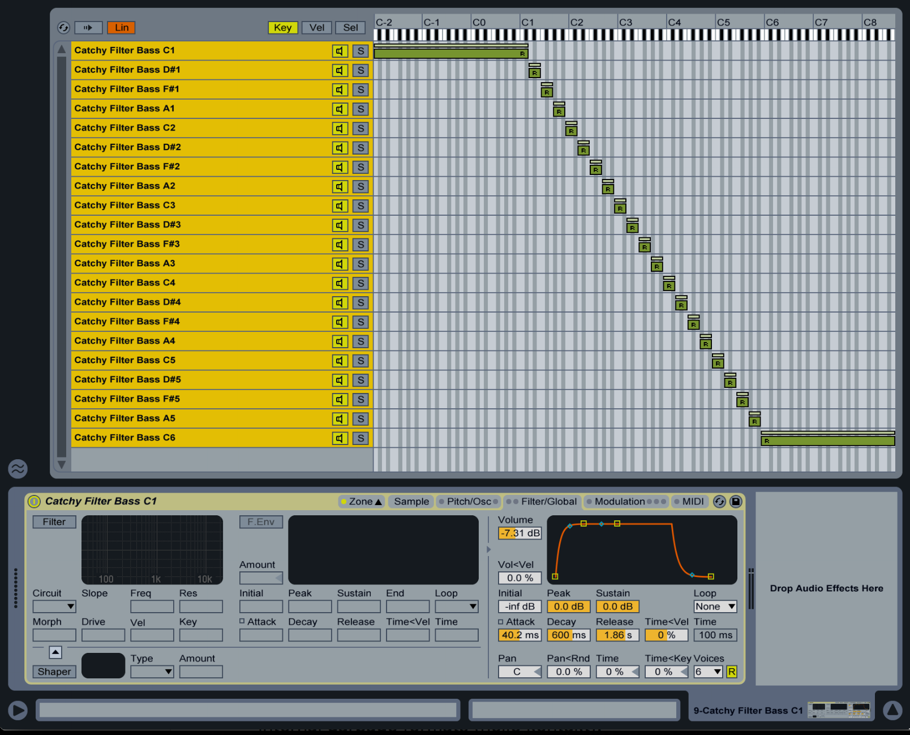

# ZODAC - the sample file tool

## Overview

A tool chain for managing samples, with functionality not found in tools of its class. Take control of your sample library and never have messy lost files in proprietary formats ever again!

- edit/create/manage RIFF/WAV metadata chunks - Instrument, Cue, Sample (INST, CUE, SMPL).
- export/sync SFZ files.

## Why?

- drag and drop WAV samples directly into supported DAWs such as Ableton and have them automatically map into a sampler instrument (cue, loop points, root note, note range, sample start/end, loop type, etc).
- loop start/end and cue is supported in every major sampler and daw ever. (logic, bitwig, kontakt, renoise/redux, etc)
- maintain a complete sample library of WAV/SFZ files and keep them synced (many samplers support SFZ if they don't support all the extended WAV chunk metadata).

The goal is to build a series of tools that will free us from any proprietary format.

At the moment, the front end command line interface is simple to use, but the underlying tool has a lot of functionality not exposed by it (just wanted to keep the front end simple for now).



Above: drag and drop your wav files in and they'll automap and configure as above.

## Eventual support:

- sf2/sf3/sf4 instruments
- flac/ogg formats
- I really need help on this but I'd like to openly support non-encrypted kontakt files, exs, etc. Lets free up these sample formats and in turn free up the audio industry, by documenting their structures in code here. This does NOT violate any laws despite what forum posters will have you think, you are transcribing/converting your own files for your own use. Don't have them tied up in garbage formats that leave your projects broken with missing samples and version mismatches when you come back to them.
- other desired import/export support: nnxt, als, xrni, bitwig multisample

## Other goals:
- a 'library' mode, which audits your entire library for problems and keeps all of your instruments organised.
- single shot mode
- drum kit mode

## Usage:
```shell
ZODAK v0.1.0 🐉🎹

Usage:
  zodak <sourcedir> <destdir>
  zodak (-h | --help)
  zodak --version

Options:
  -h --help     Show this screen.
  --version     Show version.
  ```